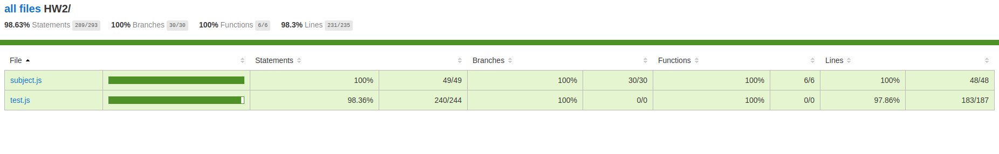
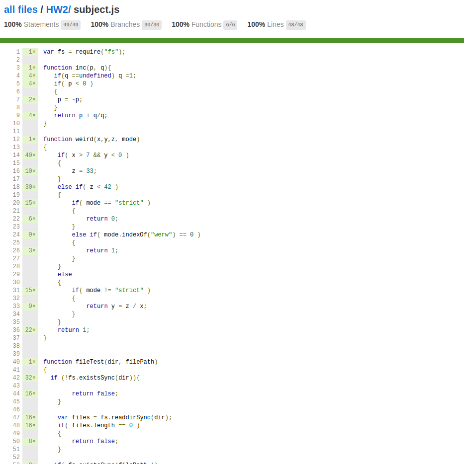
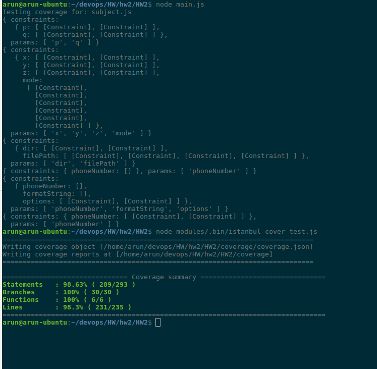
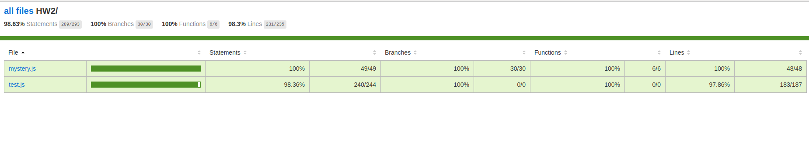
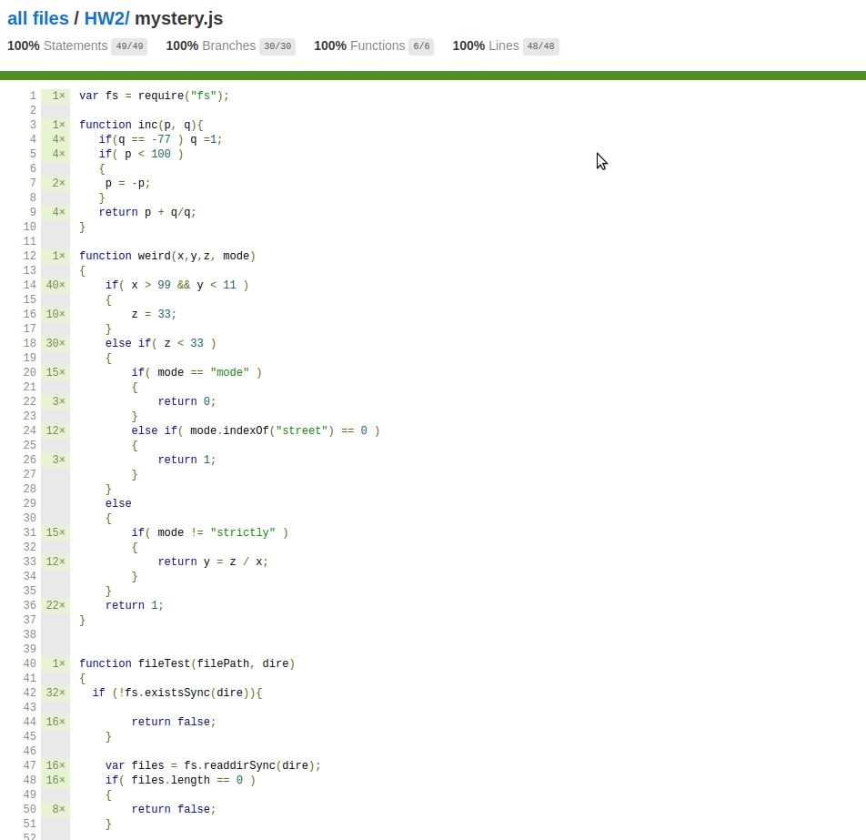
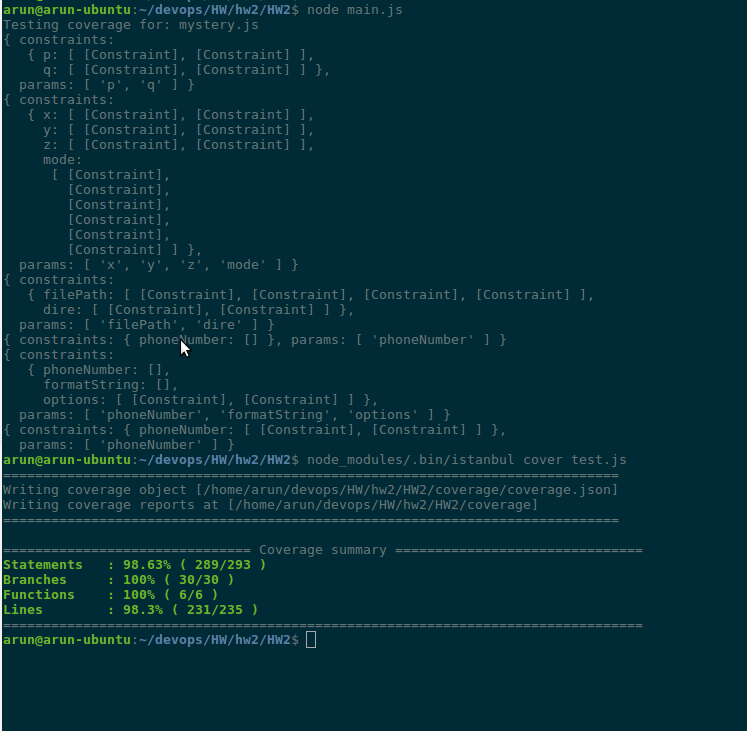

# HW2
CSC 519 - DevOps - Test Generation and Coverage using NodeJS, Istanbul (npm package) and Esprima


### Instructions to generate coverage report

#### Step One
```
git clone https://github.ncsu.edu/ajagana/HW2.git
cd HW2
npm install
```

#### Step Two
Rename the JS file for the file to be checked for coverage - (subject.js/ mystery.js in our case)

```
    if( args.length === 0 ) {
        args = ["subject.js"];
        console.log("Testing coverage for: " + args);
    }
```


#### Final Step
```
node main.js
node_modules/.bin/istanbul cover test.js
```

Running main.js will generate a test.js file which has all the test cases to test the coverage.


### Report for subject.js








### Report for mystery.js







